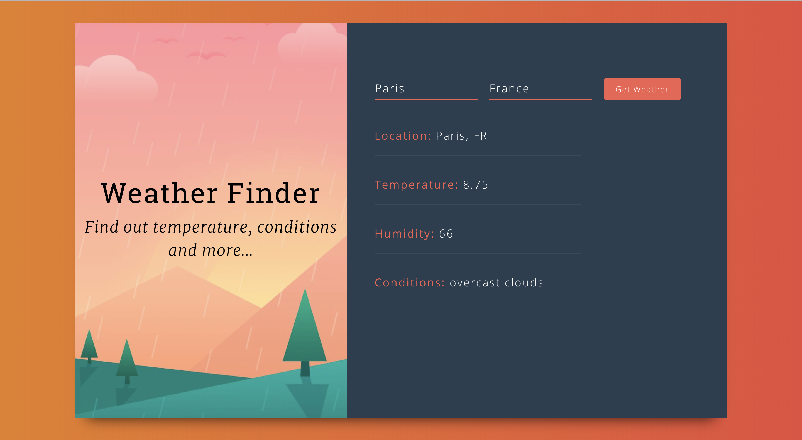

<h1 align="center">React Weather Finder</h1>



## Built With
* [React](https://reactjs.org/)
* [Open Weather Map API](https://openweathermap.org/)


## Installation

```
$ git clone https://github.com/Marie-Carrere/react-weather-finder.git
$ cd react-weather-finder
$ npm install
$ npm start
```

Go to `http://localhost:3000`.